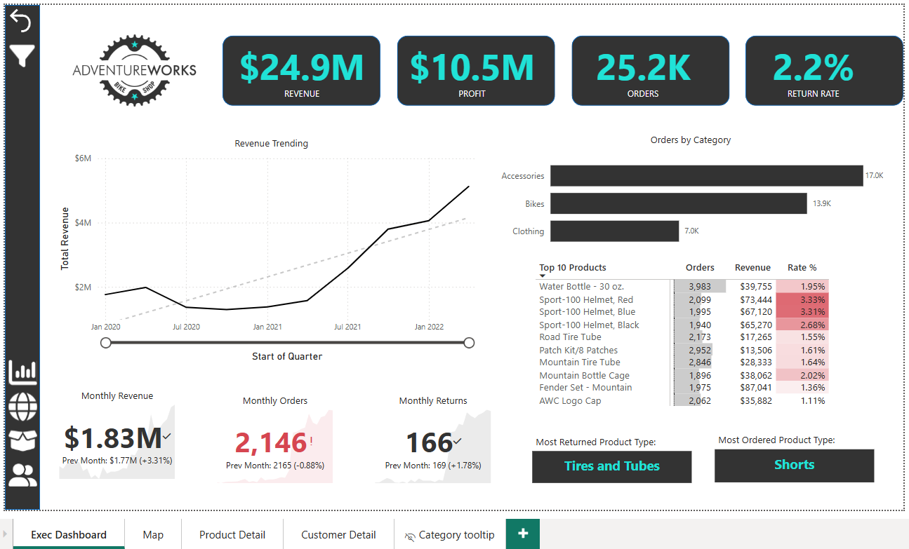
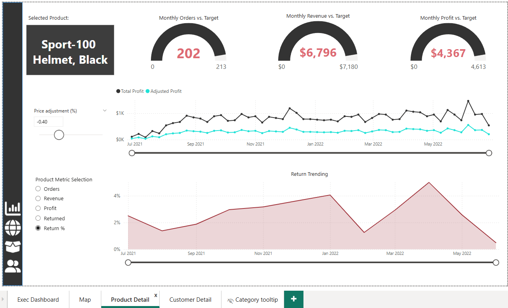
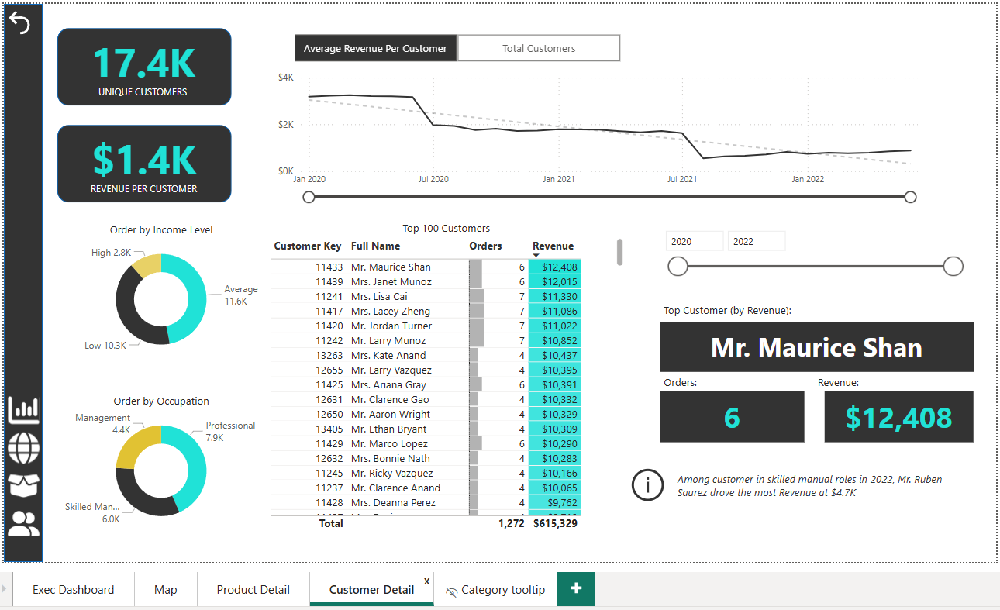

# Adventure Works Power BI Report

This repository contains a comprehensive Power BI dashboard project built using the Adventure Works dataset. It showcases real-world business intelligence (BI) skills in data extraction, transformation, modelling, DAX calculation, and dashboard design.

##  Project Overview

You’ve just been hired as a **Business Intelligence Analyst** by *AdventureWorks*, a global manufacturing company that produces cycling equipment and accessories.

###  Business Problem

The management team needed a solution to:
- Track KPIs like sales, revenue, profit, and returns
- Compare regional and product-level performance
- Identify high-value customers
- Visualise temporal trends in customer behaviour and product sales

##  Power BI Workflow

### 1. **Data Preparation**
- Extracted and cleaned raw `.csv` data using Power Query
- Applied profiling tools to handle missing values and validate data quality
- Appended multiple years of sales data
- Built lookup tables for categories, subcategories, and customers

### 2. **Data Modelling**
- Built a star schema with fact and dimension tables
- Established relationships using primary and foreign keys
- Created a calendar table and implemented hierarchies (Year > Month > Day)
- Optimised cardinality and filter direction

### 3. **DAX Calculations**
- Developed key measures: 
  - Total Sales, Total Returns, Return Rate, Profit, Revenue per Customer, etc.
- Used `CALCULATE()`, `FILTER()`, `SUMX()`, `DATESYTD()` and more for time intelligence and filtering logic
- Created calculated columns for SKU types and customer segmentation

### 4. **Visualizations**
- Designed interactive dashboards with:
  - KPIs and card visuals
  - Time-series line charts with drill-down
  - Donut and bar charts for demographic and sales analysis
  - Tooltips, slicers, and dynamic filters
  - Field parameters for toggling between key metrics

##  Key Features

-  Dynamic filtering using slicers
-  Smart bookmarks and drill-through navigation
-  Return rate calculation with conditional formatting
-  Custom tooltips and field parameters
-  Regional and category-wise return analysis
-  Mobile-optimised layout (Power BI app)

##  Tools Used

- Power BI Desktop
- DAX
- Power Query (M Language)
- GitHub for version control and collaboration

## 📸 Sample Dashboard Screens

### 📊 Executive Dashboard

### 🛍 Product Details

### 👤 Customer Insights

### 🗺️ Regional Sales Map  

###  Repository Structure

The repository includes the following key files and folders:

- Adventure Works Report.pbix – Main Power BI dashboard file  
- images – Contains dashboard screenshots  
- raw-data – CSV files used in the Power BI data model  
- README.md – Project documentation  
- LICENSE – MIT license file  

## License

This project is released under the MIT License.

